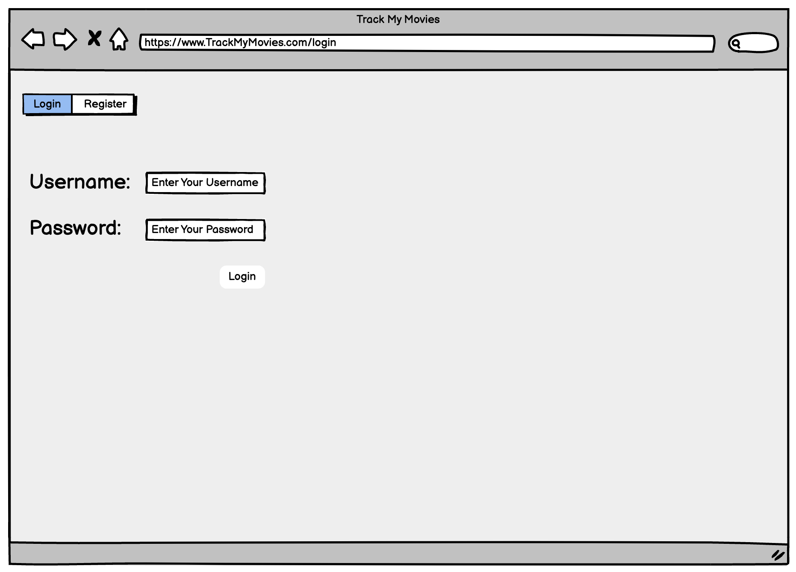
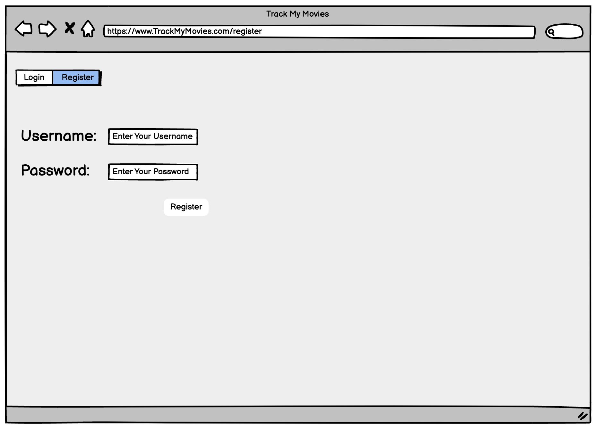
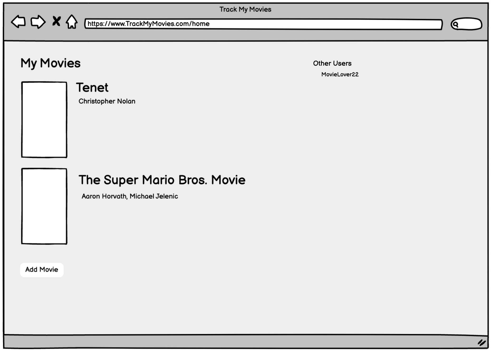
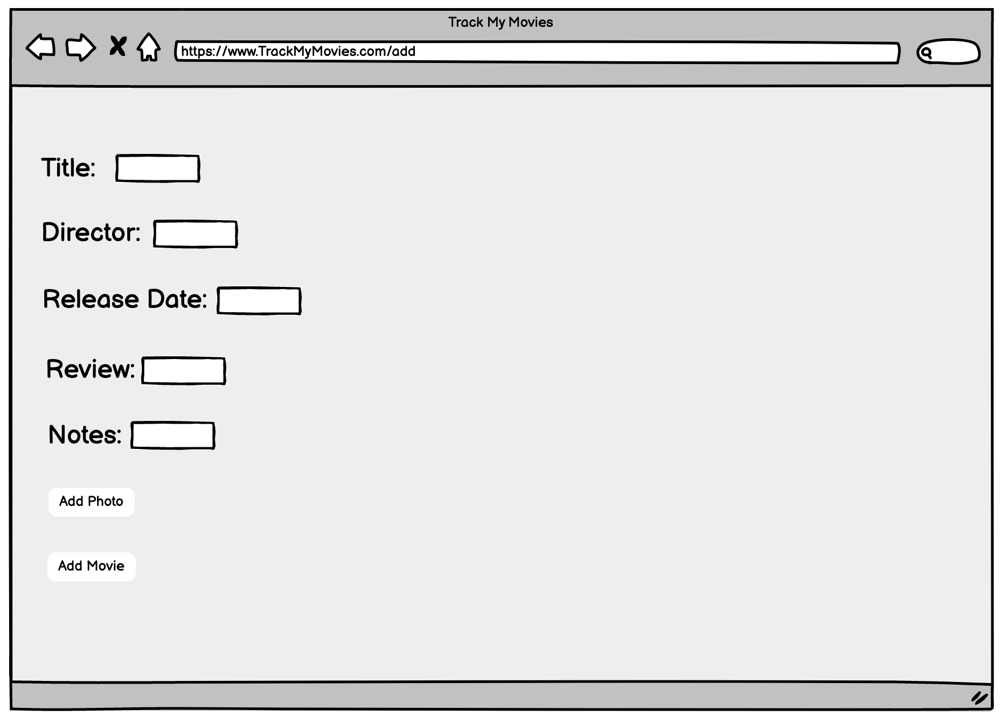
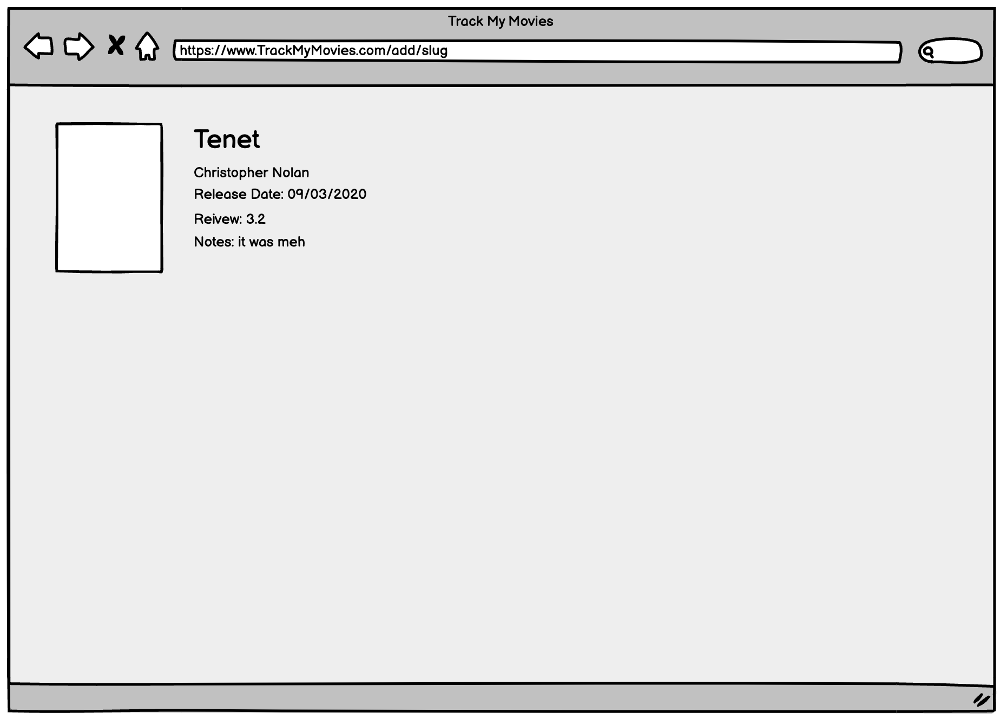
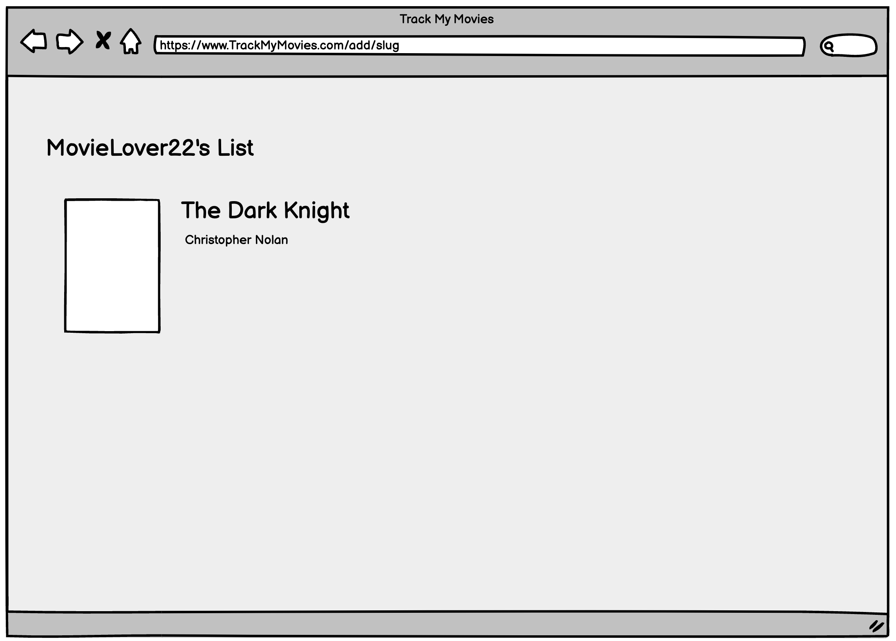
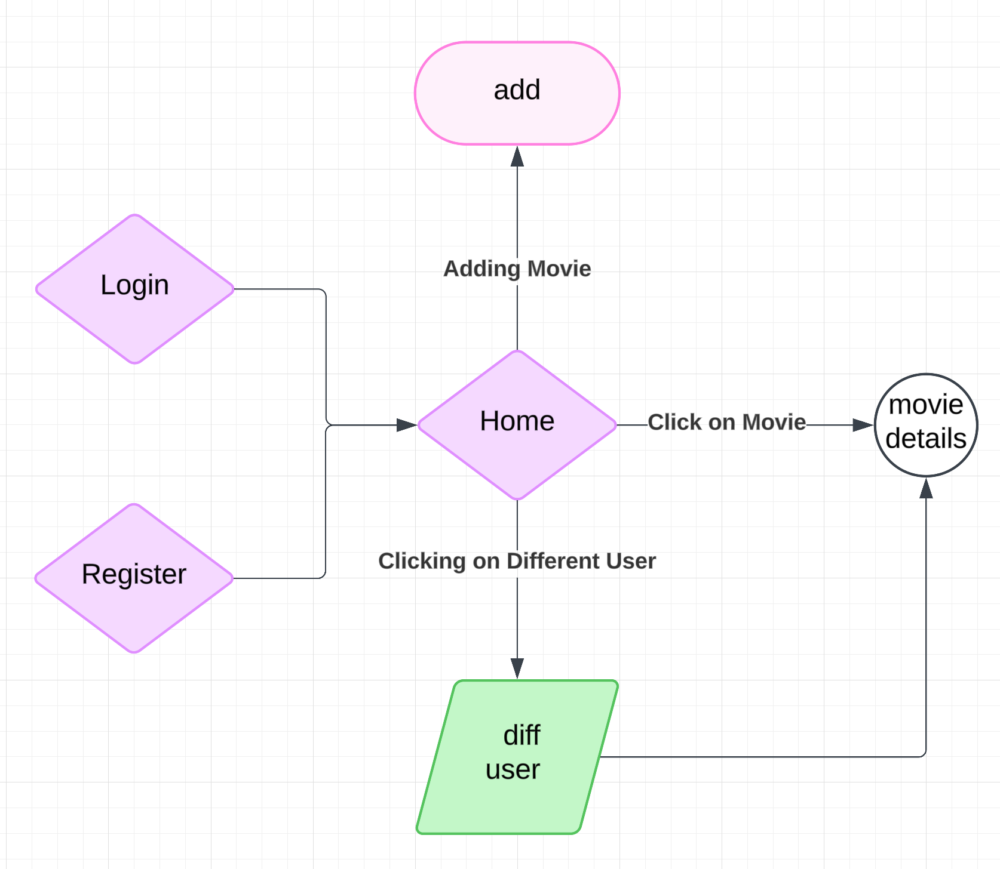

The content below is an example project proposal / requirements document. Replace the text below the lines marked "__TODO__" with details specific to your project. Remove the "TODO" lines.

# Track My Movies

## Overview

According to data collected by Popflick, the average American wathces 6 movies a year (at the theatres). Over time, that adds up to a lot of movies and it's easy to forget what you’ve seen, which ones you loved, or how you'd rate them. That's what Track My Movies is for!

Track My Movies is a web app that allows users to create an account and keep track of all the movies they've watched. Users can add movies to their watchlist with posters, write personal notes, and rate each film. Additionally, users can explore other users' profiles to discover what movies others have been watching and see their ratings and reviews. 


## Data Model

The application will store Users, and Movies

* user has a list of movies that they've watched with multiple movies (via refrences)
* each movie has a rating, notes, and a cover image

An Example User:

```javascript
{
  username: "movieEnjoyer99",
  hash: // a password hash,
  moviesWatched: references to Movie documents
}
```

An Example Movie with Embedded Items:

```javascript
{
  user: ,// a reference to a User object
  title: "Tenet",
  picture: //URL to movie poster
  review: 5,
  note: "Meh",
  release: "09/03/2020",
  addedOn: "10/23/24"
}
```


## [Link to Commented First Draft Schema](db.mjs) 

## Wireframes


/login - login page



/register - register page



/home - list of movies user has added with a some information



/add - page where user can add a movie



/home/slug - shows idividual movie in detail



/home/slug - shows another user's list


## Site map



## User Stories or Use Cases

1. as non-registered user, I can register a new account with the site
2. as a user, I can log in to the site
3. as a user, I can add a movie to my list
4. as a user, I can add notes, and reviews to my movies
5. as a user, I can view the list of all of my added movies
6. as a user, I can view other user's movie lists and movie details (reviews, notes)

## Research Topics

* (3 points) Unit testing with JavaScript
    * Testing software where individual components of the codebase are tested
    * Implement Mocha Test (testing framework)
    * 4 tests minimum in order to ensure functionality
* (2 points) CSS Framework
    * A collection of CSS and js tools that provide help with styling
    * User bootstrap for custom styling
    * Create user interface that is userfriendly and aesthetic 
* (5 points) Automated Functional Testing
    * Tools that automatically test all functionality of a web app
    * Headless Chrome to automate testing
    *  Use Headless Chrome to create automated tests, with links to testing code and screen captures of test results

10 points total out of 8 required points
  


## [Link to Initial Main Project File](app.mjs) 

## Annotations / References Used

N/A

